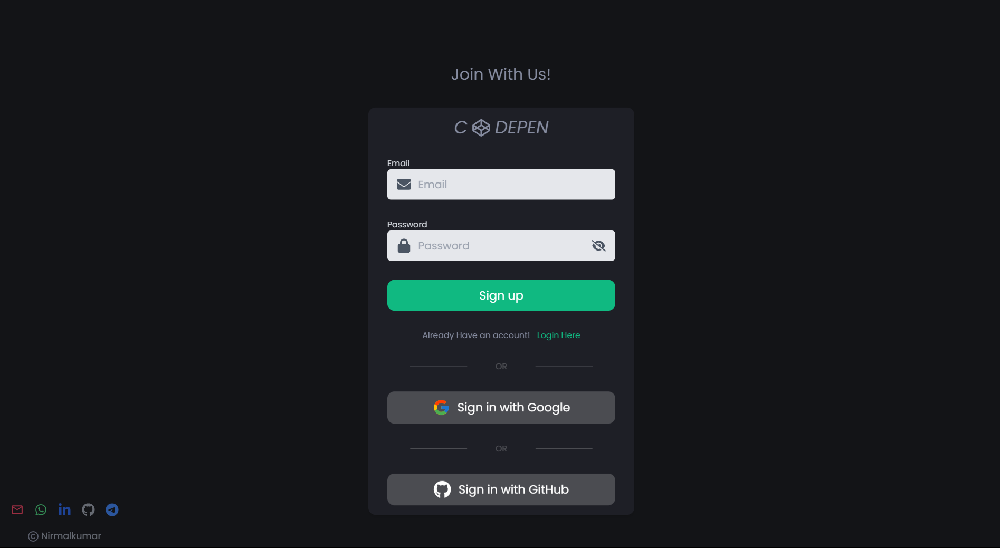

> Fullstack Food App

> Check out My Live project: [Project](https://nk-codepen-clone.web.app/)

> Check out My portfolio: [Portfolio](https://nirmalkumarofllll.github.io/Portfolio/)

> Login

> The SignUp page utilizes Firebase Authentication to manage user registration and login securely. It supports both email/password authentication and third-party sign-in options, such as Google and GitHub, ensuring flexibility and ease of access. The implementation leverages Firebase's authentication SDK to handle user credential validation, account creation, and secure session management. Additionally, error handling is integrated to provide real-time feedback on authentication failures, such as invalid credentials or locked accounts. The authentication logic is encapsulated within reusable components, promoting modularity and maintainability while ensuring a seamless user experience.

> 

> Home

> The Home page is a dynamic and interactive interface designed to display saved coding outputs while providing essential user functionalities. Built using React, Redux, and Framer Motion, it ensures a smooth and responsive user experience. The page features a sign-out option for user session management and a search bar that allows users to quickly find saved projects using case-insensitive search filtering. Saved coding outputs are displayed as interactive project cards, each containing an iframe that adjusts dynamically to fit its content. These cards showcase project details such as titles, user names, and profile images, with hover effects for better interactivity. Users can bookmark projects, visually represented by toggling bookmark icons. The layout is optimized using flexbox and CSS, ensuring proper alignment and spacing across different screen sizes. Motion-based animations further enhance the user experience, making interactions seamless and engaging.

> 

> Coding Page

> The Coding page is a dynamic web development environment supporting HTML, CSS, and JavaScript. It features CodeMirror-powered editors with syntax highlighting, auto-completion, and real-time preview for instant feedback. The SplitPane layout allows flexible resizing, while settings menus provide quick code management options. Integrated with Firebase, it enables seamless project saving, retrieval, and favorite marking. Ideal for both beginners and advanced developers, it streamlines coding, testing, and debugging in a single interface.

> 

# Getting Started with Create React App

This project was bootstrapped with [Create React App](https://github.com/facebook/create-react-app).

## Available Scripts

In the project directory, you can run:

### `yarn start`

Runs the app in the development mode.\
Open [http://localhost:3000](http://localhost:3000) to view it in your browser.

The page will reload when you make changes.\
You may also see any lint errors in the console.

### `yarn test`

Launches the test runner in the interactive watch mode.\
See the section about [running tests](https://facebook.github.io/create-react-app/docs/running-tests) for more information.

### `yarn build`

Builds the app for production to the `build` folder.\
It correctly bundles React in production mode and optimizes the build for the best performance.

The build is minified and the filenames include the hashes.\
Your app is ready to be deployed!

See the section about [deployment](https://facebook.github.io/create-react-app/docs/deployment) for more information.

### `yarn eject`

**Note: this is a one-way operation. Once you `eject`, you can't go back!**

If you aren't satisfied with the build tool and configuration choices, you can `eject` at any time. This command will remove the single build dependency from your project.

Instead, it will copy all the configuration files and the transitive dependencies (webpack, Babel, ESLint, etc) right into your project so you have full control over them. All of the commands except `eject` will still work, but they will point to the copied scripts so you can tweak them. At this point you're on your own.

You don't have to ever use `eject`. The curated feature set is suitable for small and middle deployments, and you shouldn't feel obligated to use this feature. However we understand that this tool wouldn't be useful if you couldn't customize it when you are ready for it.

## Learn More

You can learn more in the [Create React App documentation](https://facebook.github.io/create-react-app/docs/getting-started).

To learn React, check out the [React documentation](https://reactjs.org/).

### Code Splitting

This section has moved here: [https://facebook.github.io/create-react-app/docs/code-splitting](https://facebook.github.io/create-react-app/docs/code-splitting)

### Analyzing the Bundle Size

This section has moved here: [https://facebook.github.io/create-react-app/docs/analyzing-the-bundle-size](https://facebook.github.io/create-react-app/docs/analyzing-the-bundle-size)

### Making a Progressive Web App

This section has moved here: [https://facebook.github.io/create-react-app/docs/making-a-progressive-web-app](https://facebook.github.io/create-react-app/docs/making-a-progressive-web-app)

### Advanced Configuration

This section has moved here: [https://facebook.github.io/create-react-app/docs/advanced-configuration](https://facebook.github.io/create-react-app/docs/advanced-configuration)

### Deployment

This section has moved here: [https://facebook.github.io/create-react-app/docs/deployment](https://facebook.github.io/create-react-app/docs/deployment)

### `yarn build` fails to minify

This section has moved here: [https://facebook.github.io/create-react-app/docs/troubleshooting#npm-run-build-fails-to-minify](https://facebook.github.io/create-react-app/docs/troubleshooting#npm-run-build-fails-to-minify)
