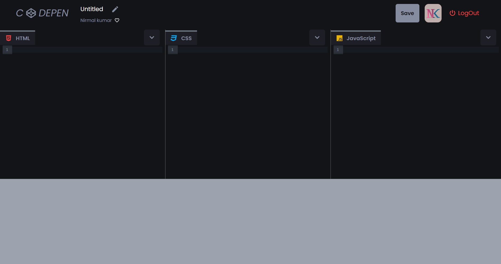

<h1 align="center">A Realtime Online Coding Platform</h1>

> Check out My Live project: <a href="https://nk-codepen-clone.web.app/" target="_blank"> Online Coding Platform</a>

> Check out My portfolio: [Portfolio](https://nirmalkumarofllll.github.io/Portfolio/)

## Login

 
The SignUp page utilizes Firebase Authentication to manage user registration and login securely. It supports both email/password authentication and third-party sign-in options, such as Google and GitHub, ensuring flexibility and ease of access. The implementation leverages Firebase's authentication SDK to handle user credential validation, account creation, and secure session management. Additionally, error handling is integrated to provide real-time feedback on authentication failures, such as invalid credentials or locked accounts. The authentication logic is encapsulated within reusable components, promoting modularity and maintainability while ensuring a seamless user experience.

## Home

 
The Home page is a dynamic and interactive interface designed to display saved coding outputs while providing essential user functionalities. Built using React, Redux, and Framer Motion, it ensures a smooth and responsive user experience. The page features a sign-out option for user session management and a search bar that allows users to quickly find saved projects using case-insensitive search filtering. Saved coding outputs are displayed as interactive project cards, each containing an iframe that adjusts dynamically to fit its content. These cards showcase project details such as titles, user names, and profile images, with hover effects for better interactivity. Users can bookmark projects, visually represented by toggling bookmark icons. The layout is optimized using flexbox and CSS, ensuring proper alignment and spacing across different screen sizes. Motion-based animations further enhance the user experience, making interactions seamless and engaging.

## Coding Page

 
The Coding page is a dynamic web development environment supporting HTML, CSS, and JavaScript. It features CodeMirror-powered editors with syntax highlighting, auto-completion, and real-time preview for instant feedback. The SplitPane layout allows flexible resizing, while settings menus provide quick code management options. Integrated with Firebase, it enables seamless project saving, retrieval, and favorite marking. Ideal for both beginners and advanced developers, it streamlines coding, testing, and debugging in a single interface.

> Learn How to do this project: [Project](https://nirmalkumarofllll.github.io/Portfolio/Codepen.html)
